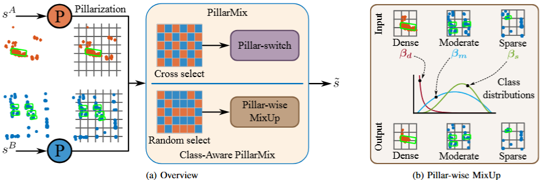

# Class-Aware PillarMix

This is the official implementation of the paper: **Class-Aware PillarMix: Can Mixed Sample Data Augmentation Enhance 3D Object Detection with Radar Point Clouds? (IROS 20205)**. The paper can
be found here: https://arxiv.org/abs/2503.02687.
The code is built on top of the mmdet3d framework and aim to reproduce the results on K-radar dataset, but also compatible with other datasets in mmdet3d.

## About

We propose Class-Aware PillarMix (CAPMix), a novel MSDA approach that applies MixUp at the pillar level in 3D point clouds, guided by class labels. Unlike methods that rely a single mix ratio to the entire sample, CAPMix assigns an independent ratio to each pillar, boosting sample diversity.  This class-aware mixing retains critical details and enriches each sample with new information, ultimately generating more diverse training data. 
### 🚧 Work in Progress
This project is actively being developed. Expect frequent changes to the code structure and possible unstable behavior or bugs.
## Installation

Please follow the installation instructions of [mmdet3d](https://mmdetection3d.readthedocs.io/en/latest/get_started.html).

After that, put the code in this repo to the `mmdetection3d/projects/` folder.
## Data Preparation
We use the K-Radar dataset for training and evaluation. Please get access [here](https://github.com/kaist-avelab/K-Radar). 
The dataset and evaluation metric is reimplemented in mmdet3d based on offcial K-radar implementation. Please check the details [here](./dataset/k_radar/README.md).
For effeiciency, we use the CFAR-point cloud processed from the raw radar data. The processing details can be found in [gen_cfar.py](./dataset/gen_cfar.py). Please modify the paths based on your own settings.

We implement the augmentation methods in LaserMix-style in mmdet3d. So in principle, it is also compatible with other datasets in mmdet3d. Feel free to try it on other datasets.😄

## Training
We provide the config files for centerpoint [here](./configs/centerpoint_kradar_capmix.py).

To train a model with CAPMix, run the following command:
```bash
python tools/train.py configs/centerpoint_kradar_capmix.py
```

## Citation
If you find this work helpful, please kindly consider citing our paper:

```
@article{zhang2025class,
  title={Class-Aware PillarMix: Can Mixed Sample Data Augmentation Enhance 3D Object Detection with Radar Point Clouds?},
  author={Zhang, Miao and Abdulatif, Sherif and Loesch, Benedikt and Altmann, Marco and Yang, Bin},
  journal={arXiv preprint arXiv:2503.02687},
  year={2025}
}
```

## License

Class-Aware PillarMix is open-sourced under the AGPL-3.0 license. See the
[LICENSE](LICENSE) file for details.

For a list of other open source components included in Class-Aware PillarMix, see the
file [3rd-party-licenses.txt](3rd-party-licenses.txt).

## Acknowledgements
This work is developed based on the [MMDetection3D](https://github.com/open-mmlab/mmdetection3d) codebase.

We acknowledge the use of the following public resources during the course of this work: [K-Radar dataset](https://github.com/kaist-avelab/K-Radar), [LaserMix](https://github.com/ldkong1205/LaserMix), [PolarMix](https://github.com/xiaoaoran/polarmix), [SSDA3D](https://github.com/yinjunbo/SSDA3D).